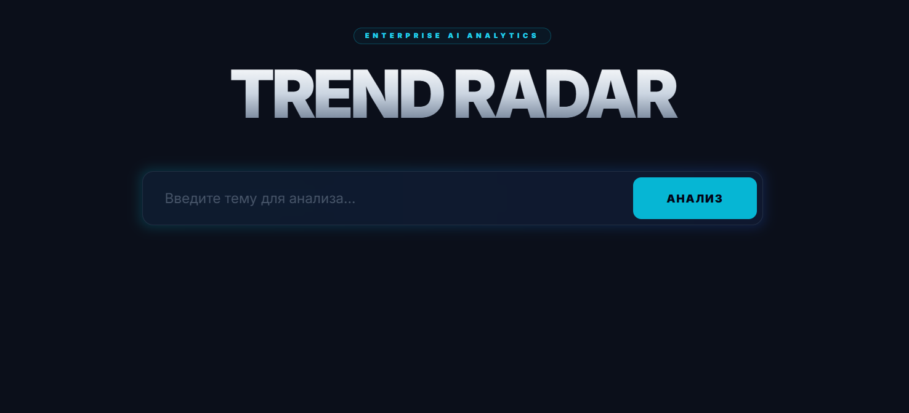

#  TrendRadar AI: Multi-Agent Market Analysis System

**TrendRadar AI** — это высокотехнологичная аналитическая платформа, предназначенная для автоматизированного мониторинга, глубокого исследования и визуализации рыночных трендов. Система использует передовые методы многоагентного моделирования на базе LLM для трансформации сырых данных из сети в структурированные стратегические отчеты.



##  1. Подробное описание и возможности системы

TrendRadar AI заменяет часы ручного поиска и анализа, предоставляя комплексное решение для исследования любых рыночных ниш. Система способна автономно обрабатывать сложные запросы, синтезировать информацию из множества источников и выдавать экспертное заключение с визуальным подкреплением.

**Ключевые возможности:**

* **Deep Web Intelligence**: Глубокое сканирование актуальных новостей, технических публикаций и рыночных отчетов в режиме реального времени.
* **Многоуровневая фильтрация**: Автоматическое отсеивание информационного шума и выделение только значимых фактов, цифр и прогнозов.
* **Динамическое прогнозирование**: Извлечение количественных данных из качественного текста для построения краткосрочных и среднесрочных трендов (2024–2026 гг.).
* **Визуальная аналитика**: Автоматическая генерация инфографики и графиков распределения трендов, готовых для вставки в презентации.
* **Интерактивные отчеты**: Формирование финальных документов в формате Markdown с сохранением активных гиперссылок на первоисточники для верификации данных.
* **Адаптивная стратегия анализа**: Встроенный роутер автоматически переключает логику системы между «Сравнительным анализом» нескольких технологий и «Сводным отчетом» по конкретной индустрии.

---

##  Архитектура агентов
Процесс обработки запроса разделен на 5 специализированных ролей для обеспечения максимальной точности и стабильности:
1.  **Router**: Анализирует интент пользователя и выбирает оптимальный алгоритм исследования.
2.  **Researcher**: Проводит итеративный поиск в сети, собирая сырой контекст и URL-источники.
3.  **Analyst**: Обрабатывает массив данных, структурируя его по макро-трендам, рискам и R&D-фундаменту.
4.  **Extractor (Visualizer)**: Изолированно работает с числовыми маркерами в тексте для безошибочной отрисовки графиков.
5.  **Editor**: Выполняет финальную стилистическую правку (Forbes-style) и форматирует технические блоки.

---

## 🛠 Технологический стек
* **Backend**: Python 3.12, FastAPI
* **AI Framework**: LangChain, OpenRouter (Llama/Qwen/GPT-4 поддержку)
* **Data Vis**: Matplotlib (Backend: Agg для серверной отрисовки)
* **Testing**: Pytest, HTTPX (асинхронное тестирование эндпоинтов)
* **DevOps**: Docker, Docker Compose для быстрой развертки

---

##  Инструкция по запуску (Docker)

### 1. Настройка окружения
Создайте в корне проекта файл `.env` и укажите параметры доступа к API:
```env
OPENAI_API_KEY=your_api_key
OPENAI_API_BASE=https://openrouter.ai/api/v1
MODEL_ID=qwen/qwen3.6-plus:free

2. Сборка и запуск
Выполните команду в терминале:

docker-compose up --build
После завершения сборки интерфейс будет доступен по адресу: http://localhost:8000

Тестирование
Для проверки стабильности системы и корректности работы всех компонентов (API, Агенты, Визуализатор) запустите тесты внутри контейнера:

# Запуск всех тестов с выводом логов прогресса агентов
docker-compose exec trend-radar pytest -s

trend-radar-ai/
├── app/
│   ├── agents.py       # Логика многоагентной системы (LangChain)
│   ├── main.py         # FastAPI эндпоинты и логика приложения
│   ├── tools.py        # Инструменты веб-поиска данных
│   ├── visualizer.py   # Генератор графиков (Matplotlib)
│   └── config.py       # Управление настройками и .env
├── storage/            # Сгенерированные данные
│   ├── charts/         # Папка для графиков (.png)
│   └── reports/        # Папка для отчетов (.md)
├── tests/              # Автоматизированные тесты (Pytest)
│   ├── test_main.py    # Тесты API эндпоинтов
│   └── test_agents.py  # Тесты внутренней логики
├── docker-compose.yml  # Файл оркестрации контейнеров
├── Dockerfile          # Инструкция сборки образа
├── .gitignore          # Игнорируемые файлы (venv, cache, storage)
└── requirements.txt    # Список всех зависимостей